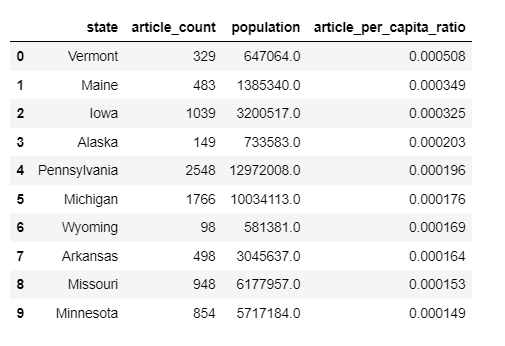
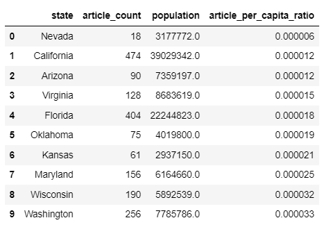
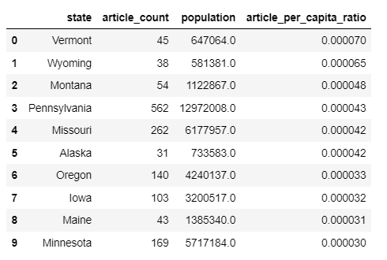
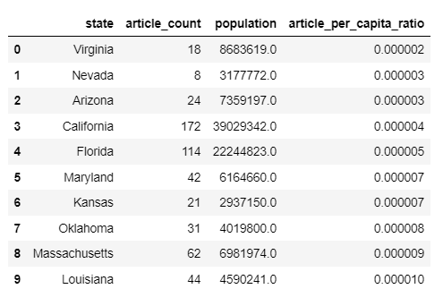
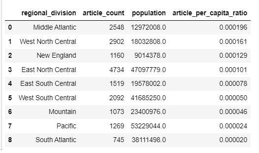
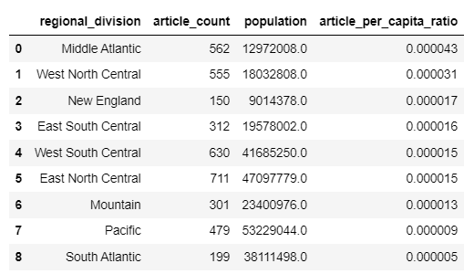

# AIM

The goal of this assignment is to explore the concept of bias in data using Wikipedia articles about cities in different US states.

# Folder Hierarchy

├── <b>Data/</b> 
&nbsp;&nbsp;&nbsp;├── Population.xlsx 
&nbsp;&nbsp;&nbsp;├── US States by Region - US Census Bureau.xlsx 
&nbsp;&nbsp;&nbsp;├── Wiki_Scraped_data.csv 
&nbsp;&nbsp;&nbsp;├── ores_score.csv 
&nbsp;&nbsp;&nbsp;├── us_cities_by_state_SEPT.2023.csv 
├── <b>Code/</b> 
&nbsp;&nbsp;&nbsp;├── Analysis.ipynb 
├── <b>Output/</b> 
&nbsp;&nbsp;&nbsp;├── wp_scored_city_articles_by_state.csv 
&nbsp;&nbsp;&nbsp;├── Analysis_1.png 
&nbsp;&nbsp;&nbsp;├── Analysis_2.png 
&nbsp;&nbsp;&nbsp;├── Analysis_3.png 
&nbsp;&nbsp;&nbsp;├── Analysis_4.png 
&nbsp;&nbsp;&nbsp;├── Analysis_5.png 
&nbsp;&nbsp;&nbsp;├── Analysis_6.png 

# Data Sources and Description

The Wikipedia Category:Lists of cities in the United States by state - us_cities_by_state_SEPT.2023.csv

The US Census Bureau provides updated population estimates for every US state - Population.xlsx

List of regions of the United States by the US Census Bureau - US States by Region - US Census Bureau.xlsx

Objective Revision Evaluation Service - A machine learning tool that can provide estimates of Wikipedia article quality. The article quality estimates are, from best to worst:

FA - Featured article

GA - Good article (sometimes called A-class)

B - B-class article

C - C-class article

Start - Start-class article

Stub - Stub-class article

# API documentation

[API Documentation](https://www.mediawiki.org/wiki/API:Info)

[API Documentation](https://www.mediawiki.org/wiki/API:Main_page)

[LiftWing documentation](https://wikitech.wikimedia.org/wiki/Machine_Learning/LiftWing)

[ORES API documentation](https://ores.wikimedia.org/docs)

[ORES LiftWing documentation](https://wikitech.wikimedia.org/wiki/Machine_Learning/LiftWing/Usage)

# Code

[Reference Code for MediaWiki API](https://colab.research.google.com/drive/15UoE16s-IccCTOXREjU3xDIz07tlpyrl)

[Reference Code for ORES API](https://colab.research.google.com/drive/17C9xsmR9U3lJeD52UTbAedlHDetwYsxs#scrollTo=GgcjNS0j2VSQ)

[License](https://creativecommons.org/licenses/by/4.0/)

# Output

Output CSV - wp_scored_city_articles_by_state.csv

The file is of the following schema which contains merged data from all the data sources:

Columns : <b> state , <b> regional_division, <b> population, <b> article_title , <b>revision_id , <b>article_quality

Analysis 1 : Top 10 US states by coverage: The 10 US states with the highest total articles per capita (in descending order) 

Analysis 2 : Bottom 10 US states by coverage: The 10 US states with the lowest total articles per capita (in ascending order) 

Analysis 3 : Top 10 US states by high quality: The 10 US states with the highest high quality articles per capita (in descending order)

Analysis 4 : Bottom 10 US states by high quality: The 10 US states with the lowest high quality articles per capita (in ascending order)

Analysis 5 : Census divisions by total coverage: A rank ordered list of US census divisions (in descending order) by total articles per capita

Analysis 6 : Census divisions by high quality coverage: Rank ordered list of US census divisions (in descending order) by high quality articles per capita

# License

This assignment code is released under the MIT License.

# Reflection and Addressing Questions

What biases did you expect to find in the data (before you started working with it), and why?

What (potential) sources of bias did you discover in the course of your data processing and analysis?

What might your results suggest about (English) Wikipedia as a data source?

Can you think of a realistic data science research situation where using these data (to train a model, perform a hypothesis-driven research, or make business decisions) might create biased or misleading results, due to the inherent gaps and limitations of the data?

Can you think of a realistic data science research situation where using these data (to train a model, perform a hypothesis-driven research, or make business decisions) might still be appropriate and useful, despite its inherent limitations and biases?

How might a researcher supplement or transform this dataset to potentially correct for the limitations/biases you observed?

